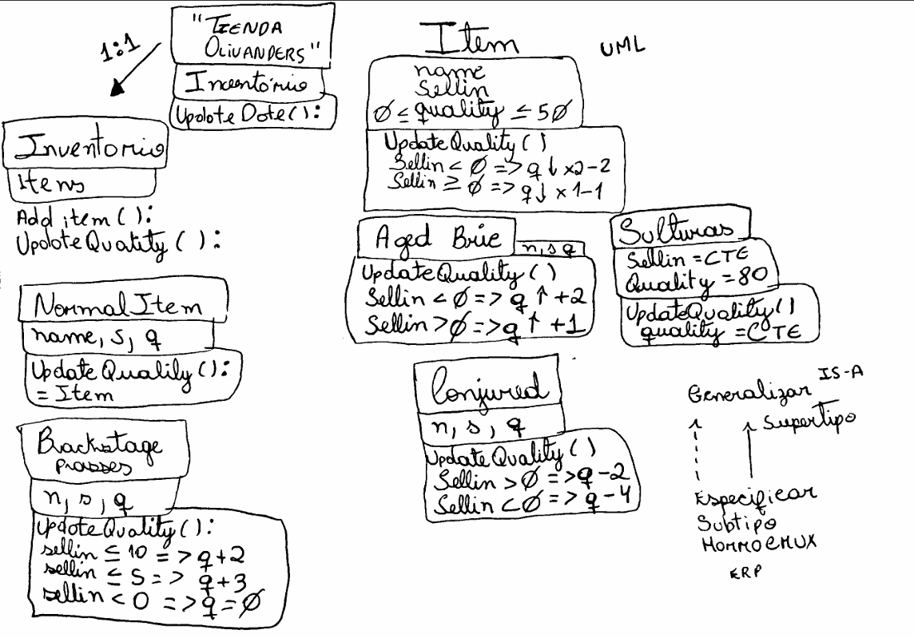

# Tienda Ollivanders – Refactorización en Python

Este proyecto es una refactorización del *Gilded Rose Kata*, adaptado a la tienda **Ollivanders**  de *Harry Potter*. El objetivo principal fue transformar un código difícil de mantener en una solución clara, modular y orientada a objetos, aplicando principios de diseño como herencia, polimorfismo y encapsulación.

---

## Objetivos del proyecto

- Reescribir la lógica de actualización de ítems usando clases y herencia.  
- Eliminar condicionales extensos y repetitivos.   
- Representar la estructura del sistema mediante un **diagrama UML**.  

---

##  Arquitectura del sistema

El sistema se organiza en dos partes principales:

###  Clase `Ollivander`
Actúa como la tienda y se encarga de:

- Guardar todos los ítems.
- Actualizar su calidad cada día.
- Añadir nuevos objetos.
- Mostrar el inventario.

La tienda **no necesita saber** cómo funciona cada tipo de ítem; solo llama a `updateQuality()`.  

## Jerarquía de ítems

Todos los objetos comparten atributos básicos:

- `name`
- `sellIn`
- `quality` (siempre entre 0 y 50, excepto Sulfuras)

A partir de la clase base, se crean subtipos con comportamientos específicos:

### **NormalItem**
- Degrada 1 punto por día.
- Después de la fecha de venta, degrada 2 puntos.

### **AgedBrie**
- Aumenta su calidad con el tiempo.
- Después de la fecha de venta, aumenta el doble.

### **Backstage**
- Aumenta +1 cuando faltan más de 10 días.
- Aumenta +2 cuando faltan 10 o menos.
- Aumenta +3 cuando faltan 5 o menos.
- Al llegar a 0 días, su calidad cae a 0.

### **Conjured**
- Se degrada al doble de velocidad que un ítem normal.

### **Sulfuras**
- Calidad fija en 80.
- No cambia nunca.

---

##  Diagrama 

  

